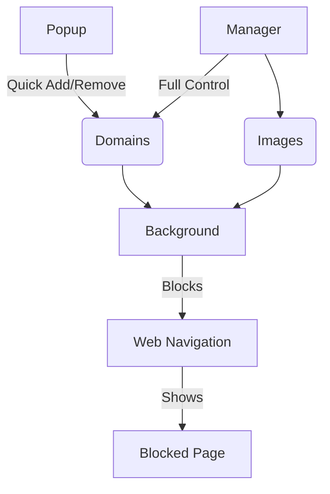

# Domain Blocker Chrome Extension

Blocks specified domains and shows a custom image instead. Version 1.2.0

## Features

✅ **Domain Management**
- Add/remove domains via popup or manager
- Persistent storage of blocked domains

✅ **Custom Block Page**
- Shows original blocked URL
- Displays custom image (set in manager)
- Falls back to default image

✅ **Image Management**
- Upload custom blocked image
- Automatic compression and resizing
- Preview before saving

## Architecture

## Installation

1. Clone this repository
2. Go to `chrome://extensions`
3. Enable "Developer mode"
4. Click "Load unpacked"
5. Select the extension directory

## Usage

- **Popup**: Quick domain management (click extension icon)
- **Manager**: Full configuration (`Open Full Manager` link in popup)

## Changelog
See [CHANGELOG.md](CHANGELOG.md) for version history

## License
MIT
