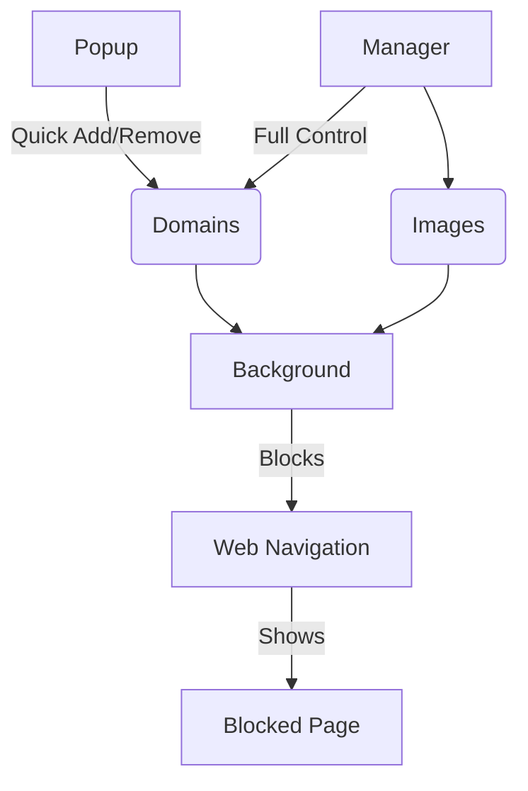

<div align="center">
  
  <h1>Focus Guard</h1>
  <p>Browser extension that protects your focus by intercepting distracting websites</p>
  
  <p>
    <a href="https://www.gnu.org/licenses/gpl-3.0">
      
    </a>
    <a href="https://codecov.io/gh/engtomhat/focus-guard">
      
    </a>
  </p>
</div>

## Features

✅ **Domain Management**
- Add/remove domains via popup or manager
- Persistent storage of blocked domains

✅ **Custom Block Page**
- Shows original blocked URL
- Displays custom image (set in manager)
- Falls back to default image

✅ **Image Management**
- Upload custom blocked image
- Automatic compression and resizing
- Preview before saving

✅ **Cross-Browser Support**
- Blocks distracting websites across multiple browsers

✅ **Profile Management**
- Manage multiple blocklists
- Switch between profiles
- Automatic migration from old storage format

## Architecture



## Installation

### From Stores
- **Chrome Web Store**: [Install Here](https://chromewebstore.google.com/detail/ppioeifofhgpmcbdpehndajepecngmgp)
- **Firefox Add-ons**: [Install Here](https://addons.mozilla.org/en-US/firefox/addon/focus-guard-pro/)

### From Release Artifacts
1. Download the latest `.zip` from [Releases](https://github.com/engtomhat/focus-guard/releases)
2. For Chrome:
   - Go to `chrome://extensions`
   - Enable "Developer mode"
   - Drag & drop `focus-guard-chrome.zip`
3. For Firefox:
   - Go to `about:debugging#/runtime/this-firefox`
   - Click "Load Temporary Add-on"
   - Select `focus-guard-firefox.zip`

### Development Build
```bash
# Clone repository
git clone https://github.com/yourusername/focus-guard.git
cd focus-guard

# Install dependencies
npm install

# Build extensions
npm run build chrome  # Chrome build
npm run build firefox # Firefox build

# Load in browser:
# Chrome: Load unpacked from dist/chrome
# Firefox: Load temporary add-on from dist/firefox
```

### Key Features
- 🚀 Background service-based blocking
- 🛡️ Universal Manifest V3 support (Chrome & Firefox)
- 📦 Single codebase for both browsers
- 🔄 Automatic profile synchronization
- ⚡ Modern ES module architecture

## Usage

- **Popup**: Quick domain management (click extension icon)
- **Manager**: Full configuration (`Open Full Manager` link in popup)

## Acknowledgements
- This project was developed with assistance from AI coding tools
- Special thanks to [Windsurf](https://windsurf.dev) and [DeepSeek](https://deepseek.com) for their coding assistance

## Changelog
See [CHANGELOG.md](CHANGELOG.md) for version history

## Support This Project

If Focus Guard helps you stay productive, consider supporting its development:

[](https://www.buymeacoffee.com/tomhat)

Your support helps maintain and improve this extension!

## Privacy Notes
🔍 Focus Guard is designed to block distracting websites, not tracking requests.  
- Allows common tracking paths (e.g., `facebook.com/tr/`) to maintain site functionality
- No user activity data is collected by the extension itself

## License
GNU General Public License v3.0 - See [LICENSE](LICENSE) for full text
