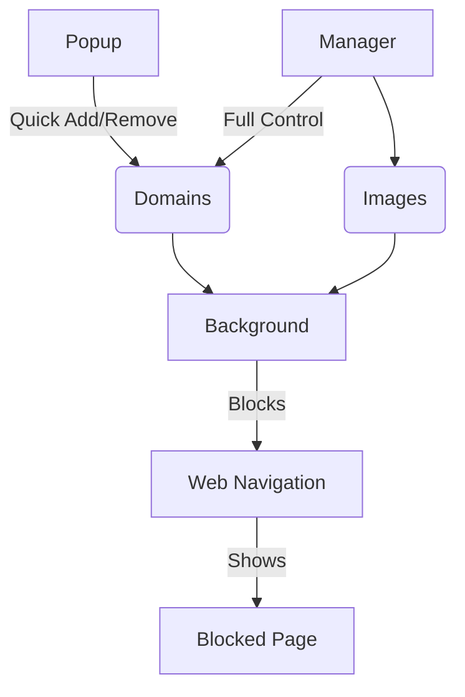

  
  <h1>Focus Guard</h1>
  
Browser extension that protects your focus by intercepting distracting websites

## Features

✅ **Domain Management**
- Add/remove domains via popup or manager
- Persistent storage of blocked domains

✅ **Custom Block Page**
- Shows original blocked URL
- Displays custom image (set in manager)
- Falls back to default image

✅ **Image Management**
- Upload custom blocked image
- Automatic compression and resizing
- Preview before saving

✅ **Cross-Browser Support**
- Blocks distracting websites across multiple browsers

## Architecture

## Installation

### Chrome
1. Clone this repository
2. Go to `chrome://extensions`
3. Enable "Developer mode"
4. Click "Load unpacked"
5. Select the `chrome` directory

### Firefox
1. Clone this repository
2. Go to `about:debugging`
3. Click "This Firefox"
4. Click "Load Temporary Add-on"
5. Select any file in the `firefox` directory

## Usage

- **Popup**: Quick domain management (click extension icon)
- **Manager**: Full configuration (`Open Full Manager` link in popup)

## Acknowledgements
- This project was developed with assistance from AI coding tools
- Special thanks to [Windsurf](https://windsurf.dev) and [DeepSeek](https://deepseek.com) for their coding assistance

## Changelog
See [CHANGELOG.md](CHANGELOG.md) for version history

## License
GNU General Public License v3.0 - See [LICENSE](LICENSE) for full text
