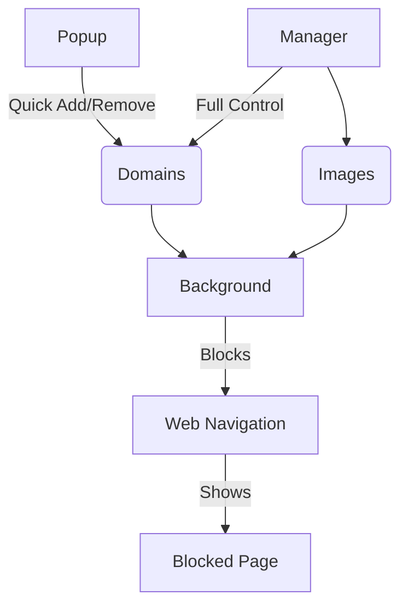

<div align="center">
  
  <h1>Focus Guard</h1>
  <p>Browser extension that protects your focus by intercepting distracting websites</p>
  
  <p>
    <a href="https://www.gnu.org/licenses/gpl-3.0">
      
    </a>
    <a href="https://codecov.io/gh/engtomhat/focus-guard">
      
    </a>
  </p>
</div>

## Features

✅ **Domain Management**
- Add/remove domains via popup or manager
- Type domains any way you like (`https://www.Example.com/page`, `*.example.com`); they're cleaned up automatically
- Blocking a site also blocks tabs already open on it
- Export/import your profiles to a file (backup, or moving to another browser)

✅ **Custom Block Page**
- Shows original blocked URL
- Displays custom image (set in manager)
- Falls back to default image

✅ **Image Management**
- Upload custom blocked image
- Automatic resizing (up to 1920px) and compression; transparency is kept
- Preview of the current image in the manager

✅ **Cross-Browser Support**
- Blocks distracting websites across multiple browsers

✅ **Profile Management**
- Manage multiple blocklists
- Switch between profiles (per device: switching on one computer doesn't switch the others)
- Automatic migration from old storage format

✅ **Accessibility**
- Keyboard-friendly manager tabs and controls
- Dark mode follows your system setting

## Architecture


```mermaid
graph TD
    A[Popup] -->|Quick Add/Remove| B(Domains)
    C[Manager] -->|Full Control| B
    C --> D(Images)
    B --> E[Background]
    D --> E
    E -->|Blocks| F[Web Navigation]
    F -->|Shows| G[Blocked Page]
```

## Installation

### From Stores
- **Chrome Web Store**: [Install Here](https://chromewebstore.google.com/detail/ppioeifofhgpmcbdpehndajepecngmgp)
- **Firefox Add-ons**: [Install Here](https://addons.mozilla.org/en-US/firefox/addon/focus-guard-pro/)

### From Release Artifacts
1. Download the latest `.zip` from [Releases](https://github.com/engtomhat/focus-guard/releases)
2. For Chrome:
   - Go to `chrome://extensions`
   - Enable "Developer mode"
   - Unzip `focus-guard-<version>-chrome.zip` and click "Load unpacked"
3. For Firefox:
   - Go to `about:debugging#/runtime/this-firefox`
   - Click "Load Temporary Add-on"
   - Select `focus-guard-<version>-firefox.zip`

### Development
Requires Node.js 22+ (CI and releases use the version in `.nvmrc`). Built with [WXT](https://wxt.dev) and TypeScript.

```bash
git clone https://github.com/engtomhat/focus-guard.git
cd focus-guard
npm install

npm run dev           # Chrome with hot reload
npm run dev:firefox   # Firefox with hot reload

npm run build         # Production builds in .output/chrome-mv3 and .output/firefox-mv3
npm run zip           # Store-ready zips in .output/ (plus the Firefox sources zip)

npm run lint          # ESLint
npm run compile       # TypeScript typecheck
npm test              # Unit tests + production build checks
npm run test:e2e      # Builds, then runs the extension in real Chromium and Firefox
```

To load a build by hand: in Chrome, "Load unpacked" from `.output/chrome-mv3`; in Firefox, `about:debugging` → "Load Temporary Add-on" → any file in `.output/firefox-mv3`.

In dev mode (`npm run dev:firefox`), Firefox may ask whether Focus Guard can "access other apps and services on this device". That's the dev server's hot reload connecting to `localhost`; allow it. Production builds never connect anywhere.

**End-to-end tests** need Playwright's Chromium (`npx playwright install chromium`) and Firefox installed. The upgrade tests run only when `E2E_UPGRADE_FROM_DIR` points at the 2.2.1 release zips (`gh release download v2.2.1 --dir <dir>`); CI always runs them.

**Screenshots** for pull requests that change what users see: `npm run build && npm run screenshots -- .output/chrome-mv3 <output dir>` (add `--dark` for dark mode).

Releases are automated; see [RELEASING.md](RELEASING.md).

### Key Features
- 🚀 Background service-based blocking
- 🛡️ Universal Manifest V3 support (Chrome & Firefox)
- 📦 Single codebase for both browsers
- 🔄 Automatic profile synchronization
- ⚡ TypeScript + [WXT](https://wxt.dev) build

## Usage

- **Popup**: Quick domain management (click extension icon)
- **Manager**: Full configuration (`Open Full Manager` in the popup, or the extension's options page)

## Acknowledgements
- This project was developed with assistance from AI coding tools
- Special thanks to [Windsurf](https://windsurf.dev) and [DeepSeek](https://deepseek.com) for their coding assistance

## Changelog
See [CHANGELOG.md](CHANGELOG.md) for version history

## Support This Project

If Focus Guard helps you stay productive, consider supporting its development:

[](https://www.buymeacoffee.com/tomhat)

Your support helps maintain and improve this extension!

## Privacy Notes
- Focus Guard makes no network requests and uses no third-party services
- Your profiles and blocked domains are stored in your browser, and synced only through your own browser account if browser sync is enabled
- No user activity data is collected by the extension itself

## License
GNU General Public License v3.0 - See [LICENSE](LICENSE) for full text
